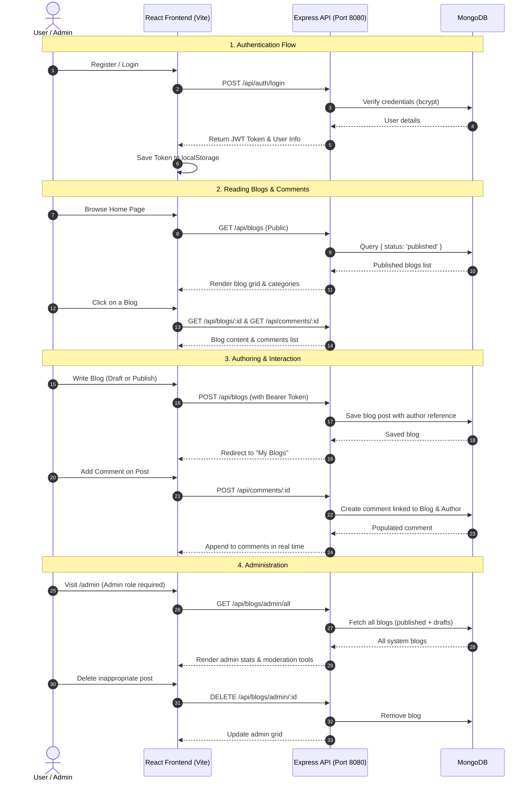

# 📝 BlogSphere - Blog Management System (MERN Stack)

A complete full-stack Blog Management System built with **MongoDB**, **Express.js**, **React 19**, and **Node.js** (Vite).

---

## 🚀 Quick Start Guide

### 1. Prerequisites
- **Node.js**: v18+ (tested with v26)
- **MongoDB**: Running locally on `mongodb://127.0.0.1:27017` (or remote MongoDB Atlas URL)

---

### 2. Start the Backend Server

Open a terminal window and run:

```bash
cd backend
npm install
npm run dev
```

> **Backend runs on:** `http://localhost:8080`  
> Connected to MongoDB database: `blogmanagement`

#### 👑 (Optional) Seed Admin Account
To create or reset the administrator account, run:
```bash
npm run seed:admin
```
- **Email:** `admin@blogsphere.com`
- **Password:** `admin123`
- **Role:** `admin`

---

### 3. Start the Frontend Application

Open a second terminal window and run:

```bash
cd frontend
npm install
npm run dev
```

> **Frontend runs on:** `http://localhost:5173`

---

## 🔄 End-to-End Application Flow



---

## 🛠️ Environment Configuration

### Backend (`backend/.env`)
```env
PORT=8080
MONGO_URL=mongodb://127.0.0.1:27017/blogmanagement
JWT_SECRET=super_secret_jwt_key_2026_blogmanagement
```

### Frontend (`frontend/.env`)
```env
VITE_API_URL=http://localhost:8080/api
```

---

## 📋 Features Checklist

- [x] **User Authentication**: Secure JWT-based registration & login with bcrypt password hashing.
- [x] **Role-Based Access Control**: Standard users vs Admins.
- [x] **Route Protection**: ProtectedRoute prevents unauthorized access to private and admin pages.
- [x] **Blog Creation & Management**: Publish or draft blogs, categorize across 10+ topics, add tags, and cover images.
- [x] **Live Search & Filter**: Real-time keyword search across title, description, and tags, plus category filtering.
- [x] **Commenting System**: Post comments on blogs, with owner and admin deletion capabilities.
- [x] **Author Dashboard ("My Blogs")**: Manage personal blogs, view draft/published status, edit and delete posts.
- [x] **Admin Dashboard**: System statistics (Total, Published, Drafts) and global blog deletion capabilities.
- [x] **Zero ESLint Errors & Modern Codebase**: Built with React 19, Vite, and centralized Axios interceptors.
